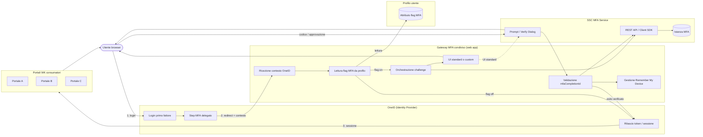
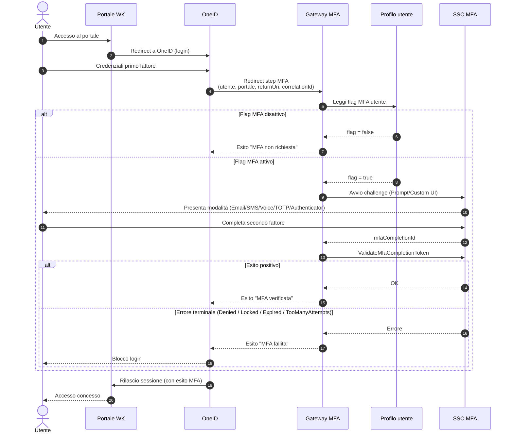

# Architettura Gateway MFA condiviso su OneID

## Sintesi

- Proposta di architettura per integrare [[ssc-mfa-service|SSC Multi-Factor Authentication (MFA) Service]] su più portali Wolters Kluwer tramite un **Gateway MFA condiviso**.
- Il gateway è una web application dedicata, inserita nel flusso di login di OneID come step successivo al primo fattore.
- Il gateway blocca l'accesso finché il secondo fattore non è completato con esito positivo.
- L'MFA è **opt-in per utente**: si attiva solo se sul profilo utente è presente un flag di abilitazione; se il flag è assente il gateway lascia proseguire il login senza challenge.
- Il gateway è l'unico punto di integrazione con [[mfa-integration-interfaces|Interfacce di integrazione MFA]]; i portali consumatori non integrano direttamente l'SDK/REST di SSC MFA.

## Diagrammi

### Vista dei componenti

### Vista di sequenza del login

## Dettagli

### Contesto e obiettivo

Più portali WK usano OneID come provider di identità di primo fattore e devono aggiungere un secondo fattore basato su [[ssc-mfa-service|SSC MFA]]. Integrare l'SDK in ciascun portale duplicherebbe configurazione, telemetria e superficie di manutenzione. Il gateway centralizza:

- la registrazione dell'istanza SSC MFA (vedi [[mfa-service-instance|Istanza del servizio MFA]]);
- l'orchestrazione del challenge;
- la validazione del completamento;
- l'applicazione delle policy trasversali (es. flag di profilo, dispositivi ricordati, IP fidati).

### Attivazione condizionata dal flag di profilo utente

- Sul profilo utente è previsto un flag booleano che abilita o meno l'MFA per quell'utente.
- Il gateway, al ricevere il contesto di sessione OneID dopo il primo fattore, legge il flag dal profilo e decide se avviare il challenge.
- Se il flag è disattivo il gateway non chiama SSC MFA e restituisce immediatamente il controllo a OneID come step completato.
- Se il flag è attivo il gateway avvia il challenge e blocca la prosecuzione del login fino a esito positivo o a errore terminale documentato ([[mfa-prompt-dialog|MFA Prompt Dialog]]: `Denied`, `SessionExpired`, `UserLockedOut`, `TooManyAttempts`, `MFAServiceUnknownError`, `MFABadRequest`).

### Componente Gateway MFA condiviso

Il gateway è una web application unica per tutti i portali, con le responsabilità principali:

- integrazione con SSC MFA tramite REST API o Client SDK .NET/Java, come previsto da [[mfa-integration-interfaces|Interfacce di integrazione MFA]];
- gestione del contesto di sessione (identificativo MFA lato server, come richiesto da [[mfa-security-controls|Controlli di sicurezza MFA]]);
- lettura del flag di abilitazione dal profilo utente;
- redirect verso la UI di challenge e ritorno del controllo al chiamante.

Per la UI del secondo fattore sono possibili due opzioni:

- **UI standard SSC**: il gateway usa [[mfa-prompt-dialog|MFA Prompt Dialog]] o [[mfa-verify-dialog|MFA Verify Dialog]], eseguendo il redirect verso `mfaUiUrl` e validando `mfaCompletionId` al ritorno.
- **UI personalizzata del gateway**: il gateway espone una UI propria e usa il [[mfa-custom-ui-flow|flusso MFA con UI personalizzata]] per Email, SMS, Voice e TOTP, mantenendo sul server l'identificativo di sessione.

### Integrazione nel flusso di login OneID

Il flusso proposto è:

1. L'utente si autentica con il primo fattore su OneID.
2. OneID redirige il browser al Gateway MFA passando il contesto (utente, portale di destinazione, URI di ritorno, correlation id).
3. Il gateway legge il flag MFA dal profilo utente:
   - flag disattivo → il gateway ritorna subito a OneID con esito "MFA non richiesta";
   - flag attivo → il gateway avvia il challenge SSC MFA.
4. Al completamento con successo il gateway ritorna a OneID che rilascia il token/session per il portale di destinazione.
5. In caso di errore terminale il gateway interrompe il flusso di login e restituisce a OneID l'esito di errore.

Finché il gateway non conferma l'esito, il login OneID resta bloccato e l'utente non riceve token o sessione applicativa per il portale finale.

### Portali applicativi consumatori

- I portali non integrano direttamente SSC MFA né gestiscono `mfaCompletionId`.
- Ricevono da OneID una sessione già arricchita con l'esito MFA verificato dal gateway.
- Restano responsabili di:
  - impostare e mantenere il flag MFA sul profilo utente (superficie di amministrazione o self-service, non descritta in wiki);
  - loggare l'esito MFA nei propri audit trail se richiesto, coerentemente con [[mfa-custom-ui-flow|flusso MFA con UI personalizzata]] e [[mfa-operations|Operatività e supporto MFA]].

### Sicurezza e sessione

Il gateway rispetta i vincoli di [[mfa-security-controls|Controlli di sicurezza MFA]]:

- l'identificativo di sessione MFA resta sul server del gateway;
- la sessione MFA è correlata all'utente autenticato da OneID prima di avviare il challenge;
- vengono onorati il timeout della sessione (default cinque minuti), le soglie di tentativi e le modalità di conformità configurate sull'istanza;
- eventuali bypass (IP fidati, utenti sandbox, utenti esclusi per monitoraggio sintetico) sono configurati sull'istanza SSC MFA e non nel codice dei portali;
- l'opzione [[mfa-registered-devices|dispositivi registrati]] ("Remember My Device") è gestita dal gateway, che è l'unico owner del cookie/credenziale dispositivo per tutti i portali.

## Collegamenti

- [[ssc-mfa-service|SSC Multi-Factor Authentication (MFA) Service]]
- [[mfa-service-instance|Istanza del servizio MFA]]
- [[mfa-integration-interfaces|Interfacce di integrazione MFA]]
- [[mfa-prompt-dialog|MFA Prompt Dialog]]
- [[mfa-verify-dialog|MFA Verify Dialog]]
- [[mfa-custom-ui-flow|Flusso MFA con UI personalizzata]]
- [[mfa-security-controls|Controlli di sicurezza MFA]]
- [[mfa-registered-devices|Dispositivi registrati MFA]]
- [[mfa-operations|Operatività e supporto MFA]]

## Contraddizioni o dubbi

- La wiki non descrive OneID come identity provider né il meccanismo tecnico con cui OneID delega uno step aggiuntivo a un gateway esterno: forma del redirect, formato del contesto passato e modalità di rientro sono da definire.
- Il flag MFA sul profilo utente non è documentato in wiki: sono da definire proprietario del dato, storage, superficie di gestione (self-service o amministrativa) e audit delle modifiche.
- Non è documentato se l'istanza SSC MFA debba essere unica per tutti i portali oppure una per portale; [[mfa-service-instance|Istanza del servizio MFA]] descrive vincoli di univocità nome ma non policy di condivisione tra applicazioni.
- L'autorizzazione dei client OneID (`OneIdClientId`) verso l'istanza è citata in [[mfa-integration-interfaces|Interfacce di integrazione MFA]] ma la wiki non specifica se il gateway debba presentarsi come singolo client oppure inoltrare l'identità del portale chiamante.
- Non è definita la strategia per il flag disattivato in modalità di conformità `Nist800-63b`: se il portale richieda comunque MFA per policy interna, il comportamento è da concordare.
- Non è descritto come vengano gestiti gli utenti con flag attivo ma senza modalità MFA configurate (nessun recapito, nessun authenticator abbinato).

## Fonti

- Wiki: [[ssc-mfa-service|SSC Multi-Factor Authentication (MFA) Service]].
- Wiki: [[mfa-service-instance|Istanza del servizio MFA]].
- Wiki: [[mfa-integration-interfaces|Interfacce di integrazione MFA]].
- Wiki: [[mfa-prompt-dialog|MFA Prompt Dialog]].
- Wiki: [[mfa-custom-ui-flow|Flusso MFA con UI personalizzata]].
- Wiki: [[mfa-security-controls|Controlli di sicurezza MFA]].
- Wiki: [[mfa-registered-devices|Dispositivi registrati MFA]].
